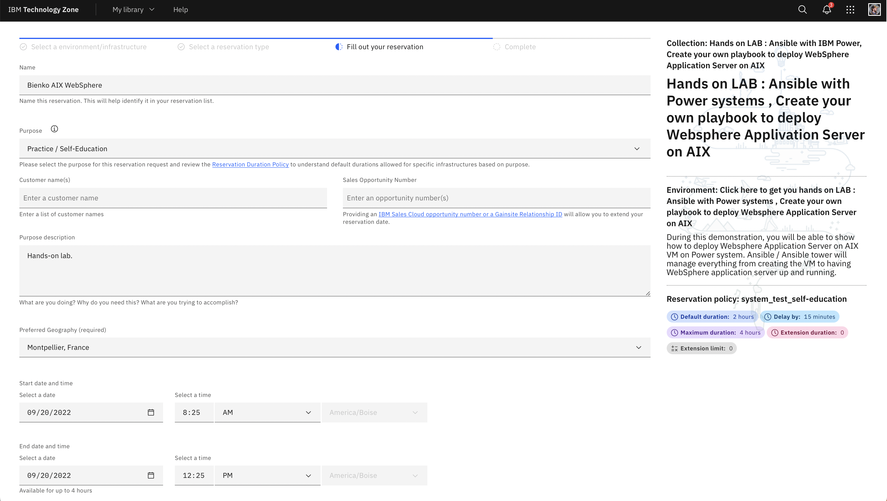
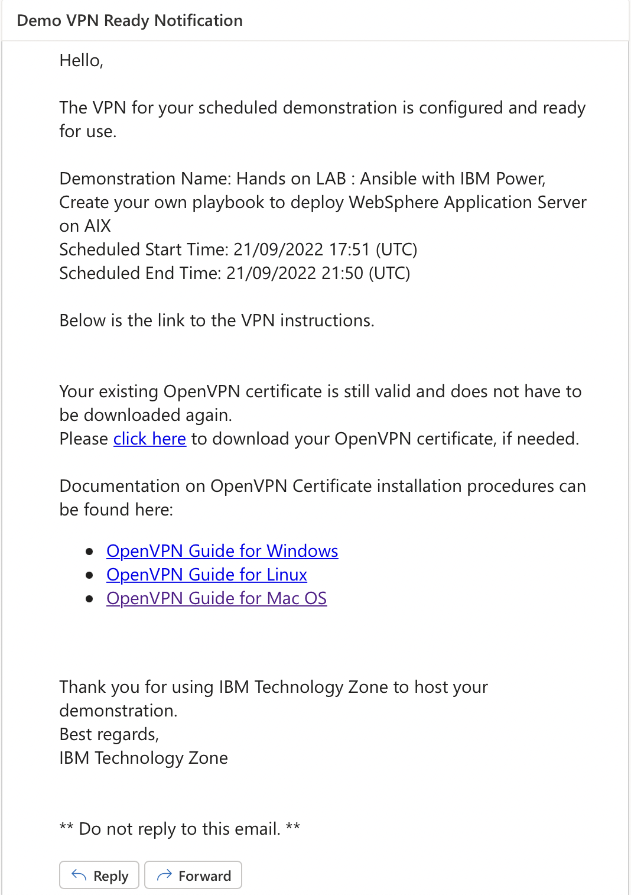
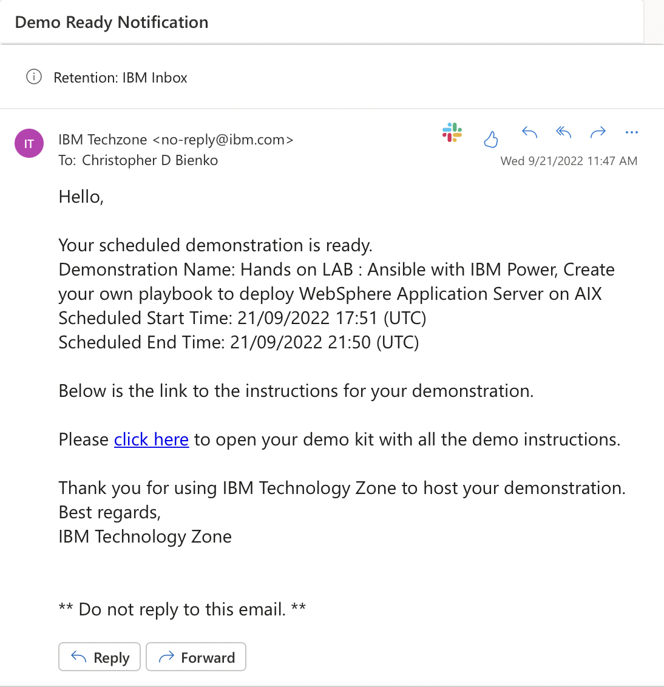
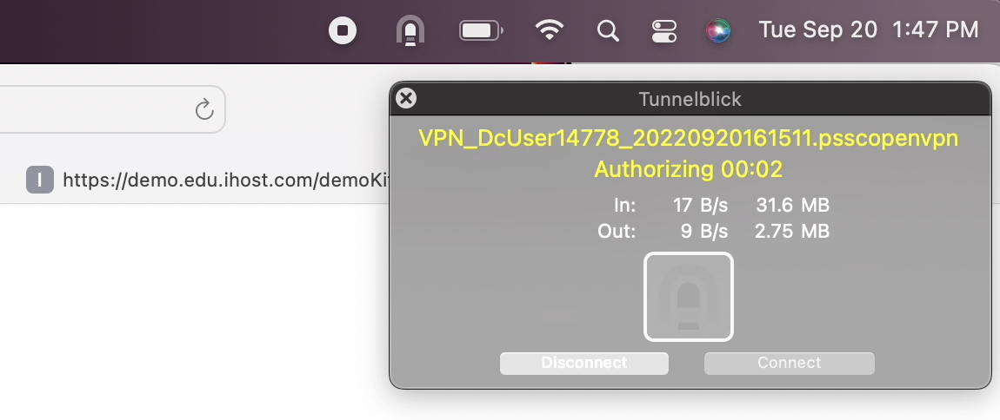

!!! tip "Ways to Watch"
    In addition to the embedded video, IBMers and Business Partners can also <a href="https://ibm.seismic.com/Link/Content/DCGdHJ7DMdqHD8cV7Wp8f4Rg9Bgd" target="_blank">download the recording from Seismic</a>.

You will require access to the **IBM Technology Zone (ITZ)** in order to reserve your environment and complete the hands-on training. If you do not yet have access or an account with the ITZ, you may register for one by visiting the following page: <a href="https://techzone.ibm.com" target="_blank">https://techzone.ibm.com</a>

The hands-on environment can be provisioned free-of-charge using the reservation portal: <a href="https://techzone.ibm.com/my/reservations/create/61aa2c69a5295f00185b77b2" target="_blank">https://techzone.ibm.com/my/reservations/create/61aa2c69a5295f00185b77b2</a>

Alternatively, you can provision the environment by navigating to the following ITZ Collection (<a href="https://techzone.ibm.com/collection/ansible-hands-on-power" target="_blank">https://techzone.ibm.com/collection/ansible-hands-on-power</a>) and scrolling down until you locate the **Environments — "Click here to get your hands on lab"** tab. Clicking the blue "Reserve" tile will navigate your browser window to the same reservation panel as the link above.



In order to complete your reservation of the PowerVC infrastructure with AAP pre-installed, you must fill out the following information:
- **Name**: Give your reservation a unique name.
- **Purpose**: Set to *Practice / Self-Education*
- **Purpose Description**: Provide a brief summary of how the environment will be used.
- **Preferred Geography**: *Montpellier, France*
- **Start Date & Time**: Select the time and date for when you plan to complete the hands-on material.
- **End Date & Time**: Select a time and date no more than 4 hours later than the Start Time. The environment has been capped at 4 hours, after which it will expire and automatically de-provision.
!!! note
    Four hours is more than enough time to complete the hands-on portion of the course work. Make sure you reserve for a period where you can give the lab 4 uninterrupted hours of your time — should you require additional time, you can reserve the lab again, but your progress from the previous attempt will be reset.

When satisfied, click the **Check Availability** button at the bottom of the page to verify that resources are available for your requested time slot. If the check passes, you can finalize your reservation request by clicking **Submit**.

Reservations take approximately 10-15 minutes to complete from the time that you click submit. If you navigate to the **My Reservations** tab of the ITZ ( <a href="https://techzone.ibm.com/my/reservations" target="_blank">https://techzone.ibm.com/my/reservations</a> ), you can monitor the progress of your reservation. Wait until the environment tile describes the instance as "*Ready*" — accessing it too soon will lead to issues (or an outright failure) when connecting to the PowerVC instance.

You will also receive a pair of emails to your inbox once the environment has successfully deployed, as shown here.





The **"Demo Ready Notification"** email contains an important link **("Click Here")** for accessing your **Project Kit**, which will be needed to obtain information about your PowerVC environment — hostname, address, login information, and so on. Click that link now to load the Project Kit in your browser window.

The second **"Demo VPN Ready Notification"** email is our next order of business. You will need to configure a special VPN tunnel in order to connect to the demo PowerVC environment.
!!! warning
    This is different from the VPN access you may be using to connect to the IBM intranet and network. All participants must follow the instructions outlined below in order to connect to the environment. Without the correct VPN setup, you will be unable to SSH or remotely connect to the PowerVC instance.

From the **"Demo VPN Ready Notification"** email, locate the **"Click Here"** hyperlink to download your **OpenVPN certificate**, which is unique to your account and environment. This certificate will only need to be downloaded and set up once; in the event that you need to re-provision a new environment at a later time, it won't be necessary to repeat these steps.

Further down in the email are three links for setting up OpenVPN, for each of the major operating systems: Windows, Linux, and MacOS. Select the option that matches your machine's operating system. Follow the instructions to install OpenVPN on your machine and use the OpenVPN certificate (linked from the same email) to establish the connection.
!!! note
    It is recommended that you use **Tunnelblick** if using running MacOS, but you have the option of using other OpenVPN clients if you prefer.




Once installed and setup, OpenVPN will allow you to establish a private VPN tunnel to your PowerVC environment. Click the **"Connect"** button (or similar — the screenshots provided here are for Tunnelblick on MacOS). You can disregard warnings or errors that the application may throw. After connecting, you will be able to access the PowerVC GUI and SSH remotely into your PowerVC environment, which we will cover next.

After connecting to the VPN tunnel, return to the **"Demo Ready Notification"** email (or the *My Reservations* tab on the ITZ) and follow the URL to your unique Project Kit page, similar to the one captured here.


The Project Kit summarizes all of the relevant connection information you will need to access your PowerVC and Ansible environment. Scroll down the page until you reach the **Usage Instructions** table near the bottom of the page.


The table contains two relevant rows: the first row **"PowerVC GUI"** contains information on how to connect to the PowerVC infrastructure; the second row **"Ansible ssh console"** details how to remotely connect to Ansible via SSH. You will be making use of both endpoints throughout the lab. As such, it's recommended that you copy the URLs for both the GUI and Ansible endpoints (note that they have different host addresses), as well as the *userID* and *password* values (they are identical across both environments).

Let's try connecting remotely over SSH to the Ansible environment. Make sure that your OpenVPN connection is active, otherwise the connection attempt will timeout. To connect via SSH, it is recommended that you use Terminal (MacOS) or <a href="https://www.putty.org" target="_blank">PuTTY</a> (Windows).
!!! note
    For detailed instructions on how to connect with PuTTY on Windows, <a href="https://ibm.box.com/s/d71tn63hutdxrjwh21qdzralrsxlcspe" target="_blank">reference the linked material.</a>

Connect via SSH using the following command:

```
ssh userID@ansibleURL
```

Replace the *userID* value with the one in the third column of the Project Kit table. Replace the *ansibleURL* with the URL in the second row + second column of the Project Kit table (for example, 10.3.44.171 in the screenshot provided— **use the value unique to your project**).

You will be prompted to provide a *password*: supply the value with the fourth column of the Project Kit table. Hit *Return* and wait for the connection to complete. If successful, your console will now be connected directly to the Ansible controller node!

Test out the connection with the following command:

```
pwd
```

Then check to see which version of Ansible the controller node is currently running:

```
ansible --version
```

Everything's now set and in good shape for you to get to work on deploying your first virtual machine via Ansible on to the PowerVC infrastructure.
