!!! tip "WAYS TO WATCH"
    In addition to the embedded video, IBMers and Business Partners can also <a href="https://ibm.seismic.com/Link/Content/DCFGW2RT6jVGm82VTDMJ6TdDJC4V" target="_blank">download the recording from Seismic</a>.

You will require access to the **IBM Technology Zone (ITZ)** in order to reserve your environment and complete the hands-on training. If you do not yet have access or an account with the ITZ, you may register for one by visiting the following page: <a href="https://techzone.ibm.com" target="_blank">https://techzone.ibm.com</a>

#
# Reserving an environment

The hands-on environment can be provisioned free-of-charge using the reservation portal: <a href="https://techzone.ibm.com/my/reservations/create/61aa2c69a5295f00185b77b2" target="_blank">https://techzone.ibm.com/my/reservations/create/61aa2c69a5295f00185b77b2</a>

Alternatively, you can provision the environment by navigating to the following ITZ Collection (<a href="https://techzone.ibm.com/collection/ansible-hands-on-power" target="_blank">https://techzone.ibm.com/collection/ansible-hands-on-power</a>) and scrolling down until you locate the **Environments — "Click here to get your hands on lab"** tab. Clicking the blue "Reserve" tile will navigate your browser window to the same reservation panel as the link above.

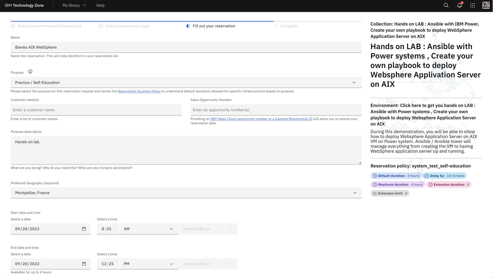

In order to complete your ITZ reservation of the PowerVC infrastructure with AAP pre-installed, you must supply the following information:

- **Name**: Give your reservation a unique name.

- **Purpose**: Set to *Practice / Self-Education*

- **Purpose Description**: Provide a brief summary of how the environment will be used.

- **Preferred Geography**: *Montpellier, France*

- **Start Date & Time**: Select the time and date for when you plan to begin work on the hands-on material.

- **End Date & Time**: Select a time and date for when the reservation will expire. By default, Tech Zone will set the default duration to 2 hours. It is recommended you set your End Time to the maximum duration of 4 hours, after which it will automatically expire and de-provision. 

!!! note "COMPLETION TIMES"
    Four hours is more than enough time to complete the hands-on portion of the course work. Make sure you place your reservation for a period where you can give the lab 4 uninterrupted hours of your time — should you require additional time, you can reserve the lab again, but your progress from the previous attempt will be reset.

When satisfied, click the **Check Availability** button at the bottom of the page to verify that resources are available for your requested time slot. If the check passes, you can finalize your reservation request by clicking **Submit**.

Reservations take approximately **15-20 minutes** to complete from the time that you click submit (this will not impact your 4 hour time allotment.) If you navigate to the **My Reservations** tab of the ITZ ( <a href="https://techzone.ibm.com/my/reservations" target="_blank">https://techzone.ibm.com/my/reservations</a> ), you can monitor the progress of your reservation. Wait until the environment tile describes the instance as "*Ready*" — accessing it too soon will lead to issues (or an outright failure) when connecting to the PowerVC instance.

You will also receive a pair of emails to your inbox once the environment has successfully deployed, as shown here.

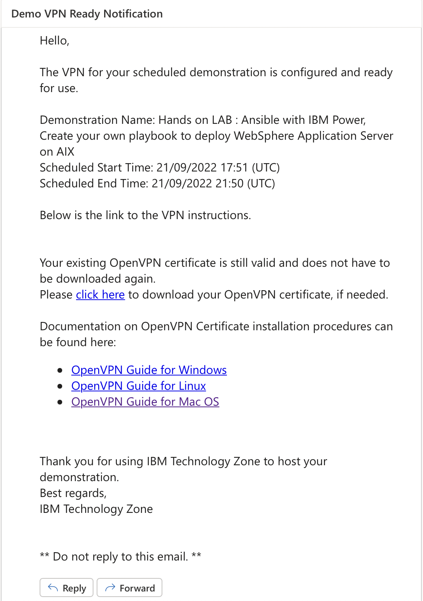

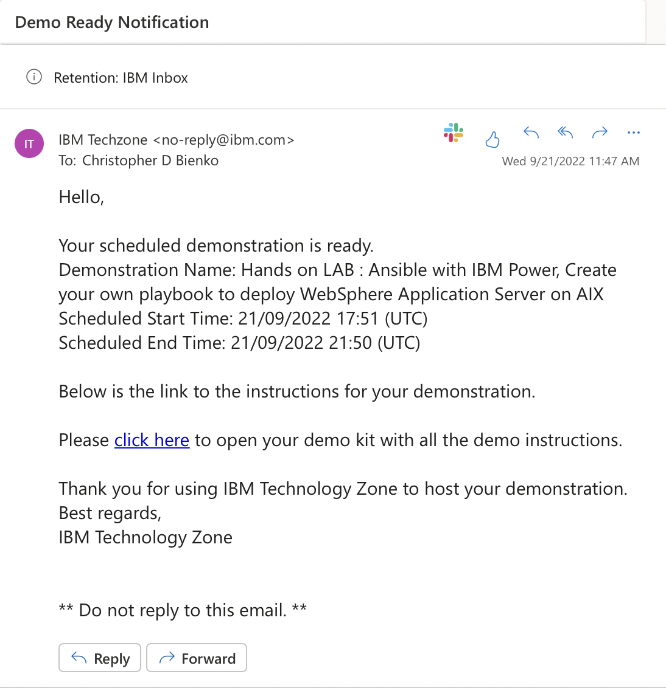

The **"Demo Ready Notification"** email contains an important link **("Click Here")** for accessing your **Project Kit**, which will be needed to obtain information about your PowerVC environment — hostname, address, login information, and so on. Click that link now to preload the Project Kit in your browser window.

#
# Setting up a VPN

The second **"Demo VPN Ready Notification"** email is our next order of business. You will need to configure a special VPN tunnel in order to connect to the demo PowerVC environment.
!!! warning "VPN ACCESS"
    This is different from the VPN access you may be using to connect to the IBM intranet and network. All participants must follow the instructions outlined below in order to connect to the environment. Without the correct VPN setup, you will be unable to SSH or remotely connect to the PowerVC instance.

From the **"Demo VPN Ready Notification"** email, locate the **"Click Here"** hyperlink to download your **OpenVPN certificate**, which is unique to your account and environment. This certificate will only need to be downloaded and set up once; in the event that you need to re-provision a new environment at a later time, it won't be necessary to repeat these steps.

Further down in the email are three links for setting up OpenVPN, for each of the major operating systems: Windows, Linux, and MacOS.
!!! note "CLIENT SELECTION"
    It is recommended that you use **Tunnelblick** if using running MacOS, but you have the option of using other OpenVPN clients if you prefer.

Download the <a href="https://tunnelblick.net" target="_blank">latest Tunnelblick client</a> (*v3.8.7a* or later) to your local machine and run the installer. Click **Continue** when prompted to do so, as shown below.

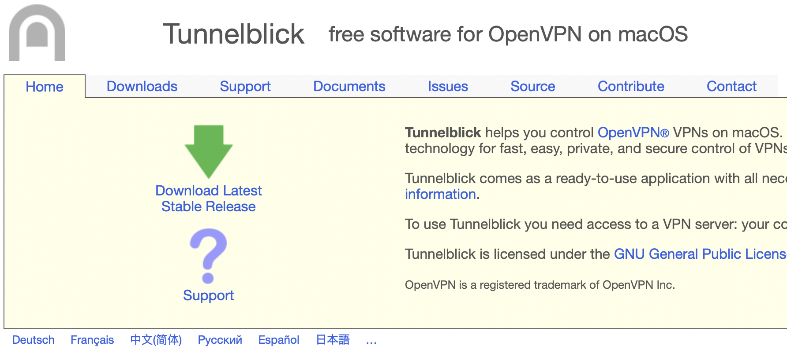

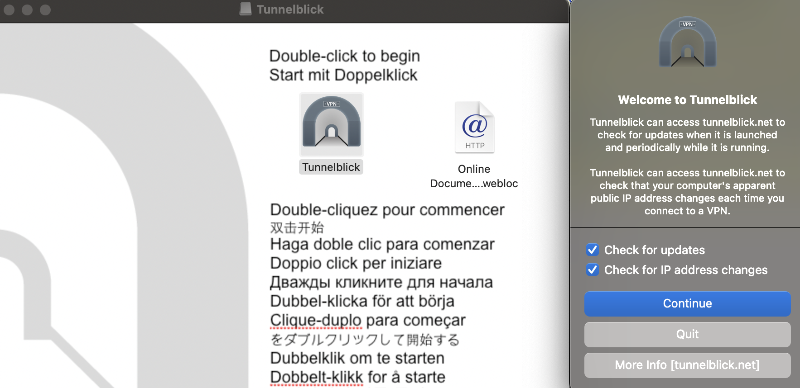

After the initial setup, Tunnelblick will prompt you to answer **"I have configuration files"** (or not). Select the first highlighted option as shown.

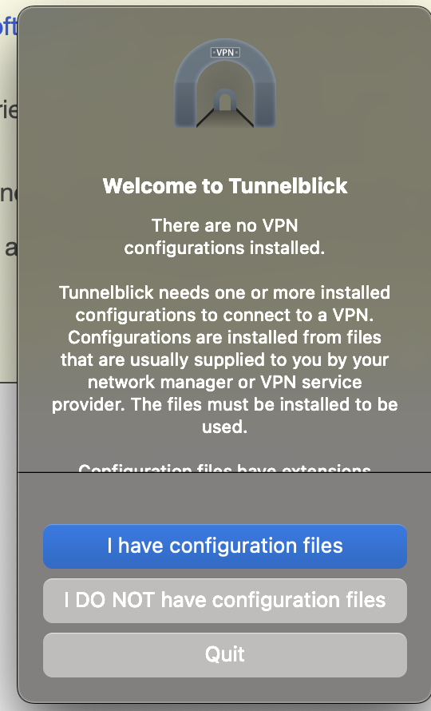

Along the taskbar at the top of your desktop, an icon for Tunnelblick will now be visible. Click the icon to pull down a menu of options — select the **VPN Details...** button.

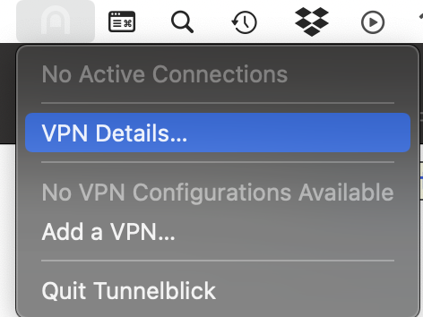

The full Tunnelblick interface will open. Locate the **OpenVPN certificate** you downloaded earlier (it will have a filename similar to ```VPN_DcUser13097_20221011201513.psscopenvpn.ovpn```) and **DRAG** the certificate over the Tunnelblick interface (as shown). Alternatively, you can also drag it directly on top of the Tunnelblick icon located in the desktop taskbar. Release the certificate on top of the Tunnelblick app to add the OpenVPN certificate to configure Tunnelblick to use the connection.

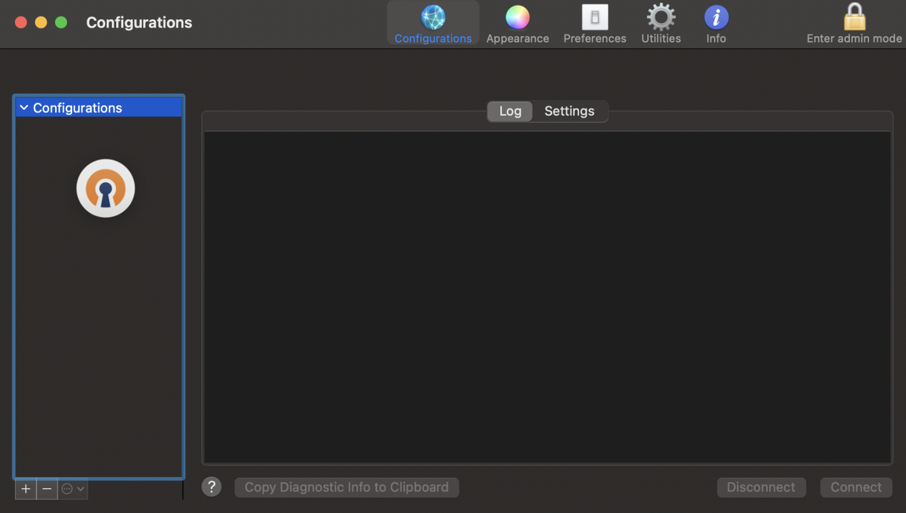

You will be prompted to *"Install Configuration for All Users?"* to which you must select the **ALL USERS** option.

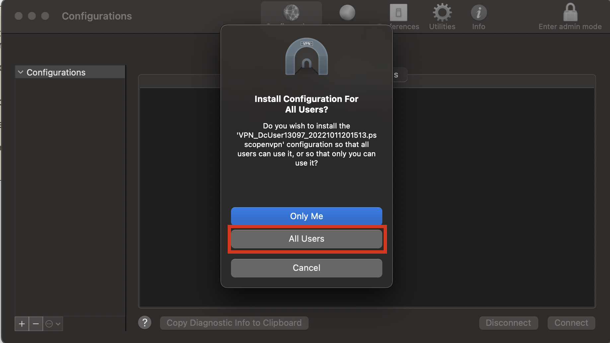

The OpenVPN connection will now display among the list of configurations. In the bottom-right corner of the Tunnelblick interface, click the **Connect** button.

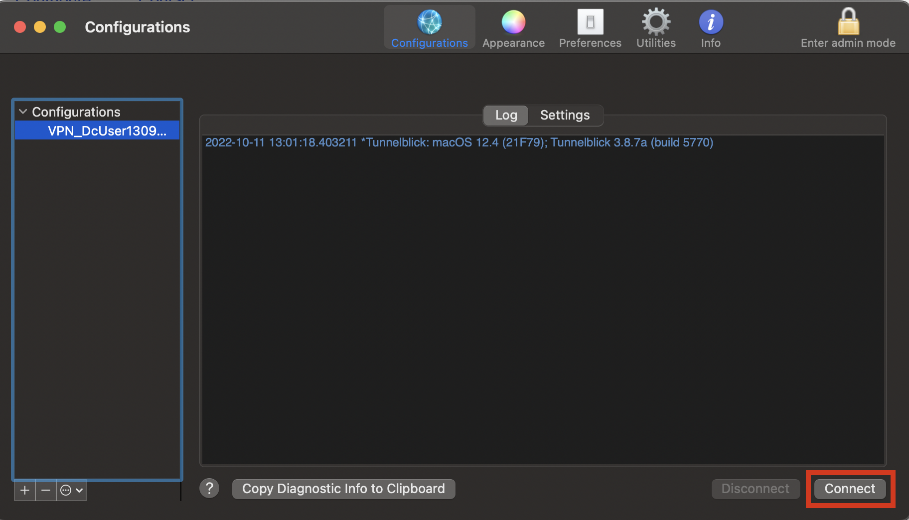

Wait for the connection to be established. You may receive a pair of warnings — which you can safely ignore.

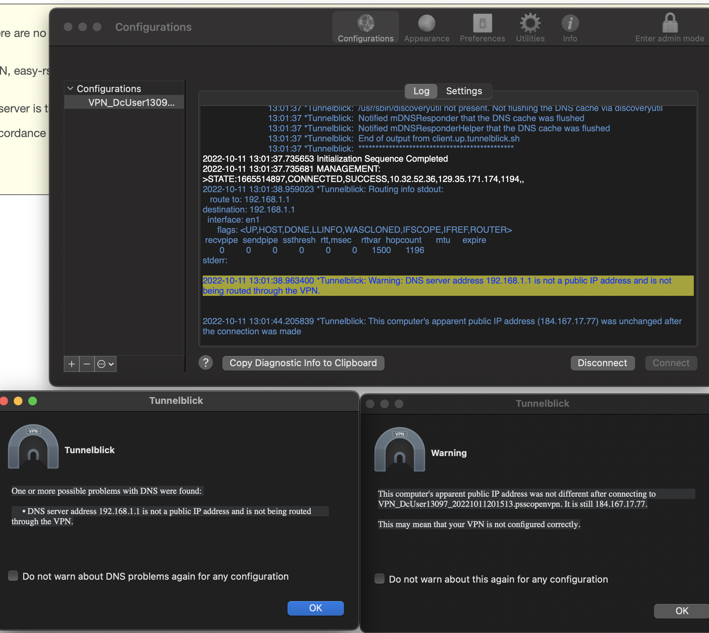

After connecting, you will be able to access the PowerVC GUI and SSH remotely into your PowerVC environment. Return to the **"Demo Ready Notification"** email (or the *My Reservations* tab on the ITZ) and follow the URL to your unique Project Kit page, similar to the one captured in the screenshot below.

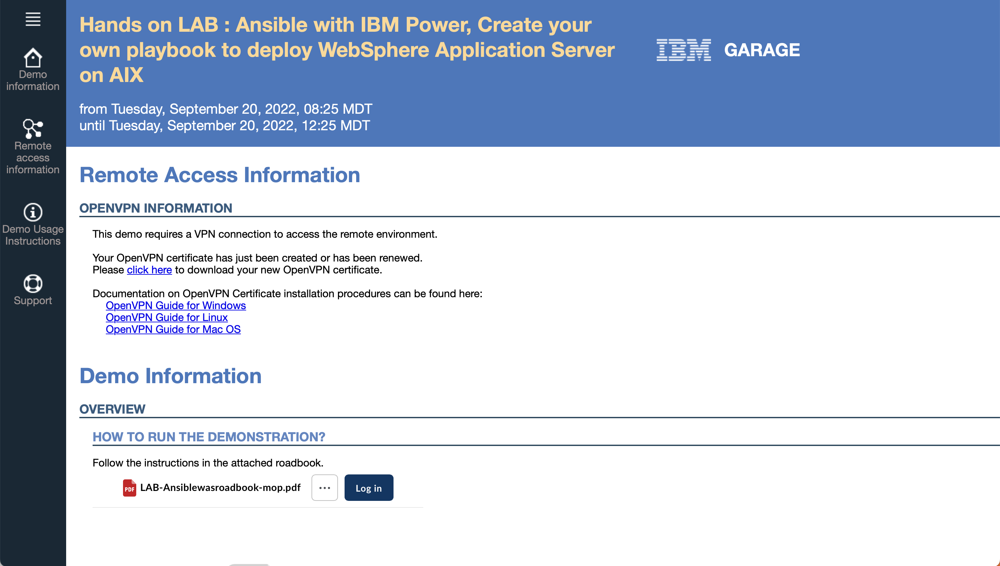

The Project Kit summarizes all of the relevant connection information you will need to access your PowerVC and Ansible environment. Scroll down the page until you reach the **Usage Instructions** table near the bottom of the page.


The table contains two relevant rows: the first row **"PowerVC GUI"** contains information on how to connect to the PowerVC infrastructure; the second row **"Ansible ssh console"** details how to remotely connect to Ansible via SSH. You will be making use of both endpoints throughout the lab. As such, it's recommended that you copy for future reference the URLs for both the GUI and Ansible endpoints (note that they have different host addresses), as well as the *userID* and *password* values (they are identical across both environments).

Let's try connecting remotely over SSH to the Ansible environment. Make sure that your OpenVPN connection is active, otherwise the connection attempt will timeout. To connect via SSH, it is recommended that you use Terminal (MacOS) or <a href="https://www.putty.org" target="_blank">PuTTY</a> (Windows).
!!! note "SSH and PuTTY - WINDOWS USERS"
    For detailed instructions on how to connect with PuTTY on Windows, <a href="https://ibm.box.com/s/d71tn63hutdxrjwh21qdzralrsxlcspe" target="_blank">reference the linked material.</a>

Connect via SSH using the following command:

```
ssh userID@ansibleURL
```

Replace the *userID* value with the one in the third column of the Project Kit table. Replace the *ansibleURL* with the URL in the second row + second column of the Project Kit table (for example, 10.3.44.171 in the screenshot provided— **use the value unique to your project**).

You will be prompted to provide a *password*: supply the value with the fourth column of the Project Kit table. Hit *Return* and wait for the connection to complete. If successful, your console will now be connected directly to the Ansible controller node!

Test out the connection with the following command:

```
pwd
```

Then check to see which version of Ansible the controller node is currently running:

```
ansible --version
```

Everything's now set and in good shape for you to get to work on deploying your first virtual machine via Ansible on to the PowerVC infrastructure.
