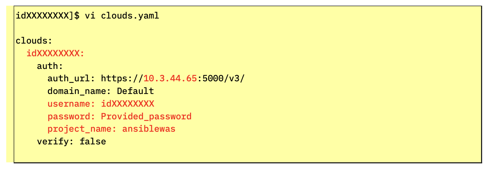
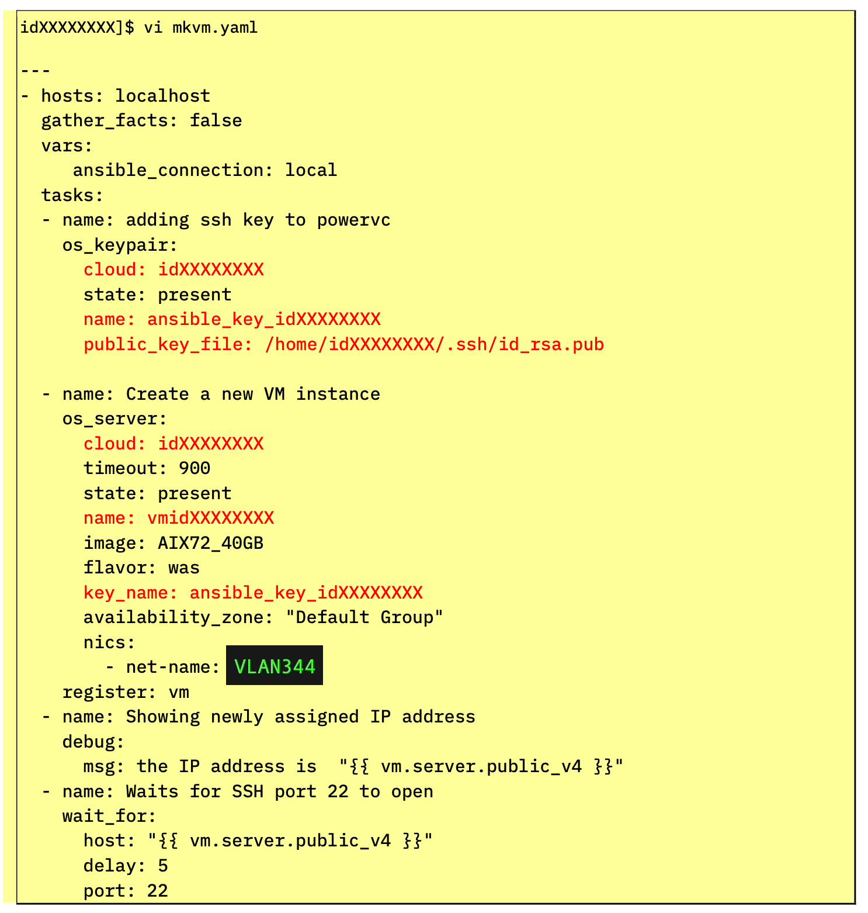

!!! tip "Ways to Watch"
    In addition to the embedded video, IBMers and Business Partners can also <a href="https://ibm.seismic.com/Link/Content/DCGdHJ7DMdqHD8cV7Wp8f4Rg9Bgd" target="_blank">download the recording from Seismic</a>.

The deployment of an AIX operating system partition on to the PowerVC infrastructure will be automated entirely via the Ansible control (master) node. Ansible will make use of the inventory we've defined, a Playbook that we will modify to paint the broad strokes for what automation is to be performed, and built-in Modules that are part of Ansible's engine to carry out those instructions. Ansible OpenStack Modules— downloaded in the previous step —will allow Ansible to create an LPAR (logical partition) on the PowerVC infrastructure where the AIX operating system can reside.

Begin modification of the OpenStack configuration file (located within your home directory on the Ansible control node) using the following instruction:
```
vi clouds.yaml
```

If you cloned the Git repository earlier, a template has already been crafted for you; otherwise, you will need to recreate it using the sample code below.

Regardless of the route you take, you will need to modify the template to the specifications of your ITZ credentials and environment. The value **idXXXXXXXX** must be replaced with the *username/ID* that was recorded from the Project Kit page.

The same holds true for other variables or fields that have been bolded below in the sample script: if it is highlighted in red text within the screenshot, you must modify the clouds.yaml script for those fields to your own specifications and then save the changes before moving on.
!!! note
    Remember: **ESC** and then **:x** followed by the **Return** key to save your work and exit the VI editor.

The *clouds.yaml* template should look like the following screenshot. Modify as necessary to match the specifications of your unique ITZ environment. Update the userID, password, project name (*ansiblewas*), and the host address (this address should match the PowerVC GUI address from the Project Kit).



```
clouds:
  idXXXXXXXX:
    auth:
      auth_url: https://10.3.44.65:5000/v3/
      domain_name: Default
      username: idXXXXXXXX
      password: Provided_password
      project_name: ansiblewas
    verify: false

```

!!! warning "Be careful about indentation"
    Ansible is very particular about indentation and nesting rules. In this example, every indentation level is denoted by two whitespaces. Also be sure to preserve the empty newline at the end of this example (the empty final line must be present within your YAML manifest.)

After modifying and saving the *clouds.yaml* manifest file, we need to define the Playbook which Ansible will execute against. Modify (or create) the Playbook for generating a virtual machine via the following:
```
vi mkvm.yaml
```

As before, adjust the template as necessary: you will need to substitute your own values for:

- user

- gather_facts

- cloud

- public_key_file

- cloud

- name

- key_name

- net-name

!!! note "Keys automatically generated ahead of time"
    The **ansible_key_idXXXXXXXX** and the **public_key_file** were created automatically for you by the IBM Technology Zone as part of your environment reservation. You do not need to generate or locate these files yourself — simply modify the *idXXXXXXXX* value to match your *userID*.



The code template is available below for ease of copying and modifying your own variant:
````markdown
```
---
- hosts: localhost
  gather_facts: false
  vars:
     ansible_connection: local
  tasks:
  - name: adding ssh key to powervc
    os_keypair:
      cloud: idXXXXXXXX
      state: present
      name: ansible_key_idXXXXXXXX
      public_key_file: /home/idXXXXXXXX/.ssh/id_rsa.pub

  - name: Create a new VM instance
    os_server:
      cloud: idXXXXXXXX
      timeout: 900
      state: present
      name: vmidXXXXXXXX
      image: AIX721_7022_300G_DEMO
      flavor: was
      key_name: ansible_key_idXXXXXXXX
      nics:
        - net-name: VLAN344
    register: vm
  - name: Showing newly assigned IP address
    debug:
      msg: the IP address is "{{ vm.server.public_v4 }}"
  - name: Waits for SSH port 22 to open
    wait_for:
      host: "{{ vm.server.public_v4 }}"
      delay: 5
      port: 22
      sleep: 10
      timeout: 900
```
````
