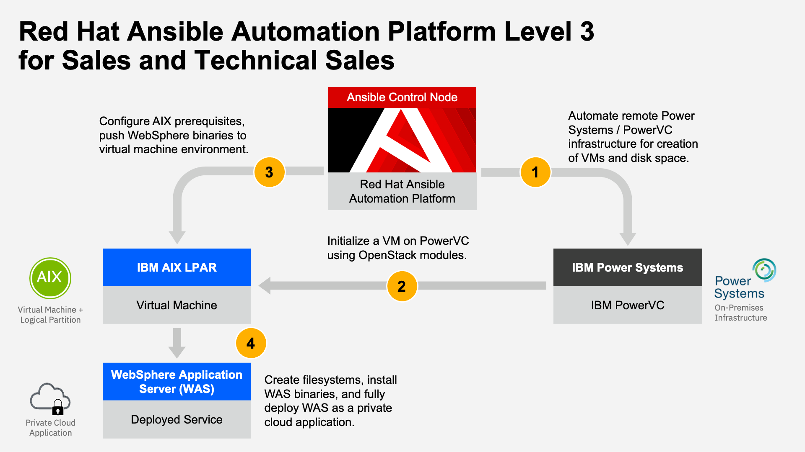
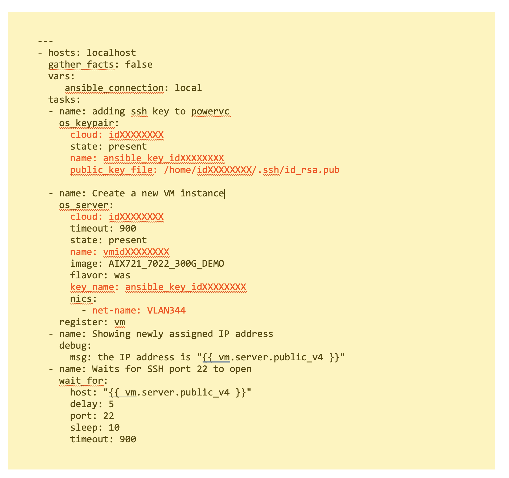
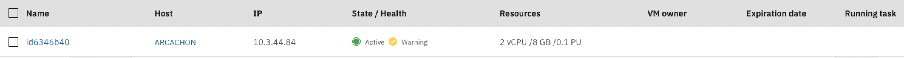

!!! tip "WAYS TO WATCH"
    In addition to the embedded video, IBMers and Business Partners can also <a href="https://ibm.seismic.com/Link/Content/DC9B3JDG242PgGFFM6fQ2fRBqTpB" target="_blank">download the recording from Seismic</a>.

The deployment of an AIX operating system partition on to the PowerVC infrastructure will be automated entirely via the AAP control (master) node. AAP will make use of:

- The ```.hosts``` definition created in the previous steps

- Playbooks that we will modify to paint the broad strokes for what automation AAP is to perform

- Built-in Modules (which are part of AAP's engine) for carrying out those instructions.



**Ansible OpenStack Modules**— downloaded in the previous step —will allow AAP to create an LPAR (logical partition or host) on the PowerVC infrastructure where the AIX operating system can reside. Begin modification of the OpenStack configuration file (located within your home directory on the Ansible control node) using the following instruction:
```
vi clouds.yaml
```

If you cloned the Git repository earlier, a template has already been crafted for you; otherwise, you will need to recreate it using the sample code below.

!!! warning "SELLERS AND TECH SELLERS"
    Both job roles will need to modify the *cloud.yaml* template to specifications matching your ITZ credentials and environment. The value **idXXXXXXXX** must be replaced with the *username/ID* that was recorded from the Project Kit.

    The same holds true for other variables or fields that have been bolded below in the sample script: if it is highlighted in red text within the screenshot, you must modify the *clouds.yaml* script for those fields to your own specifications and then save the changes before moving on.

The *clouds.yaml* template should look like the following screenshot. Modify as necessary to match the specifications of your unique ITZ environment. Update the *userID*, *password*, *project name* (```ansiblewas```), and the *host address* (this address should match the PowerVC GUI address from the Project Kit).


```
clouds:
  idXXXXXXXX:
    auth:
      auth_url: https://10.3.44.65:5000/v3/
      domain_name: Default
      username: idXXXXXXXX
      password: Provided_password
      project_name: ansiblewas
    verify: false

```

!!! note "BE CAREFUL WITH INDENTATION"
    AAP is very particular about indentation and nesting rules. In this example, every indentation level is denoted by two whitespaces. Also be sure to preserve the empty newline at the end of this example (the empty final line must be present within your YAML manifest.)

After modifying and saving the *clouds.yaml* manifest file, we need to define the Playbook which Ansible will execute against. Modify (or create) the Playbook for generating a virtual machine via the following:
```
vi mkvm.yaml
```

As before, adjust the template as necessary: you will need to substitute your own values for:

- user

- gather_facts

- cloud

- public_key_file

- name

- key_name

- net-name

!!! note "KEYS ARE AUTOMATICALLY GENERATED"
    The **ansible_key_idXXXXXXXX** and the **public_key_file** were created automatically for you by the IBM Technology Zone as part of your environment reservation. You do not need to generate or locate these files yourself — simply modify the *idXXXXXXXX* value to match your *userID*.



The code template is available below for ease of copying and modifying your own variant:


```
---
- hosts: localhost
  gather_facts: false
  vars:
     ansible_connection: local
  tasks:
  - name: adding ssh key to powervc
    os_keypair:
      cloud: idXXXXXXXX
      state: present
      name: ansible_key_idXXXXXXXX
      public_key_file: /home/idXXXXXXXX/.ssh/id_rsa.pub

  - name: Create a new VM instance
    os_server:
      cloud: idXXXXXXXX
      timeout: 900
      state: present
      name: vmidXXXXXXXX
      image: AIX721_7022_300G_DEMO
      flavor: was
      key_name: ansible_key_idXXXXXXXX
      nics:
        - net-name: VLAN344
    register: vm
  - name: Showing newly assigned IP address
    debug:
      msg: the IP address is "{{ vm.server.public_v4 }}"
  - name: Waits for SSH port 22 to open
    wait_for:
      host: "{{ vm.server.public_v4 }}"
      delay: 5
      port: 22
      sleep: 10
      timeout: 900
```



!!! warning "```os_server: name```"
    For the '*name*' field (line 11) you must include both ```vm``` + ```idXXXXXXXXX``` ( do not forget to prefix with ```vm```) in your manifest. The '*name*' variable will appear as **BLANK** when working from the Git repository clone — both sellers and technical sellers **must complete** this variable definition regardless of whether they are working from the Git repository clone or not.

!!! warning "```nics: net-name```"
    The '*net-name*' field must be set equal to ```VLAN344```, if it hasn't already been by default.

Save and exit the *mkvm.yaml* Playbook once satisfied. Let's take a moment, before moving on, to parse out what some of these fields and modifications have done.

- **os_keypair**: Allows Ansible to upload your account's public SSH key to PowerVC, which will be used at deployment time to ensure that we won't need to use password authentication in the future.

- **os_server**: Creates the virtual machine on the cloud name defined within the *clouds.yaml* manifest file.

- **debug**: Will print to screen the IP address assigned to PowerVC once deployed. Record this information for later.

- **wait_for**: Ensures that the virtual machine has had time to boot up and the SSH port to be opened before re-enabling prompts from the terminal.

Before we get started with execution of the Playbook, open a Web browser on your local machine and navigate to the PowerVC GUI URL (in the first row of the Project Kit table), supplying your *userID* and *password* from the same table when prompted to log in. This will load a dashboard overview of your PowerVC infrastructure which details all that is transpiring under the covers. Keep this tab open, as we can use it to track the progress of the virtual machine deployment.


You may encounter a *"Connection is not private"* warning when attempting to access the website. Click **"visit this website"** at the bottom of the message (for Safari browsers), or ignore the warning if prompted to do so, and continue to the PowerVC GUI page. The dashboard will look similar to the one captured in the screenshot below.


Time to execute the Playbook! Return to your Terminal console and submit the following:
```
ansible-playbook mkvm.yaml -v
```

While execution of the Playbook is underway, return to the PowerVC dashboard and click the VM List button from the taskbar on the left. Previously this tab would have displayed as empty. As the execution of the Playbook gets underway, a new virtual machine will be listed with the status of "*Building*;" once the virtual machine has been deployed, the status will be adjusted to "*Active*."


If everything goes smoothly, a virtual machine will be deployed to PowerVC in a matter of minutes. If you encounter errors or things don't go as planned — don't panic. AAP, as warned about previously, is quite particular about things like indentation. A misplaced whitespace or a slipped finger on the keyboard can create a typo that will throw the script into disarray (after all, Ansible will try to execute your instructions exactly as you have written.)

Go back into the scripts mentioned previously and verify that everything is correct and that all necessary substitutions have been made, then execute the ```ansible-playbook mkvm.yaml -v``` instruction a second time.


!!! note "HEALTH STATUS"
    While provisioning of the VM is underway, you may notice that the *State / Health* of the VM temporarily displays a *'Warning'* message. You can safely ignore the warning — but for those curious as to why: when you deploy a virtual machine, it remains in the Activating state until either Resource Monitoring and Control (RMC) becomes active or 20 minutes have passed. There are several reasons for the virtual machine to stay in the Activating state for 20 minutes and the health of the virtual machine shows that the RMC state is inactive. If you are using the activation engine or cloud-init activation packages, the most likely cause for RMC to be inactive is that the activation package did not configure the networking of the virtual machine.

Once the build task has completed and the status is set to "*Active*," the IP field of the table will be populated with the virtual machine's address. Record this information for later.


Return to the Terminal console where you have SSH'd into the AAP control node. Take note of the verbose logs that were returned for every stage of the Playbook execution. Within these logs you'll find details on various aspects of the virtual machine deployment, such as the Image ID (e.g. *AIX721-7022-300G-DEMO*) for the AIX partition. If you return to the PowerVC dashboard and drill down into the **Image List** tab, you can locate the matching Image ID and inspect it for additional details.

While you're on the dashboard, try exploring the **Network ID** (e.g. *VL344*) as well. Here you will find a table summarizing all of the networks defined with your PowerVC instance, including their VLAN IDs, Type, the number of VMs using that particular network connection, subnet masks, gateway IDs, and DNS server(s).

Other areas of the PowerVC dashboard can also be explored, should you wish. When satisfied, we'll proceed with modifying the **hosts** file parameters on the Ansible control node using the newly-generated virtual machine IP address. The **hosts** file provides a list (an inventory, if you will) of the AIX partitions (the newly-generated virtual machine) where AAP is to execute Playbook tasks.

Edit the **hosts** file using the following statement:
```
vi hosts
```

As before, use the template already cloned from Git (or craft your own) and substitute the placeholder IP address with the one associated with the newly-deployed AIX virtual machine.


```
was:
  hosts:
    10.3.44.XX:
      remote_tmp: /tmp/

```

!!! note "WHAT IS *WAS*?"
    The *was* variable is in reference to the Compute Template used by our PowerVC virtual machine deployment; it was defined ahead of time for the ITZ environment specifically to meet the resource requirements for WebSphere Application Server (*was*). You can drill down into the **Compute Template** tab from the PowerVC dashboard if you wish to inspect further details about it.

In the following section, we'll set the stage for a full deployment of WebSphere Application Server atop of the AIX VM that is now running on PowerVC infrastructure.
