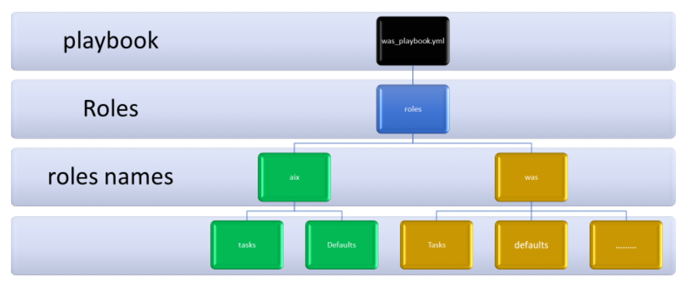

!!! tip "WAYS TO WATCH"
    In addition to the embedded video, IBMers and Business Partners can also <a href="https://ibm.seismic.com/Link/Content/DCGdHJ7DMdqHD8cV7Wp8f4Rg9Bgd" target="_blank">download the recording from Seismic</a>.

The preparations are complete and the groundwork has been set for a fully-automated installation and deployment of **WebSphere Application Server (WAS)** via AAP. At this stage, you have already used Ansible to deploy a virtual machine with an AIX partition atop of PowerVC infrastructure. Additional configurations will need to be made to that partition to prepare it for hosting a WAS deployment within it. These types of configuration changes are precisely the type of operational work that can be easily automated by Ansible, and a prime example of how businesses today are offloading administrative burdens through automation.

In the following steps, you will instruct Ansible to perform the following operations:

- Change root user characteristics using the *power_aix* Ansible modules, downloaded via Ansible Galaxy.

- Change the */tmp* filesystem size to 6GB

- Change the */var* filesystem size to 2GB

- Change the */opt* filesystem size to 4GB

- Change the */usr* filesystem size to 6GB

- Install additional software and libraries such as zip, unzip, and gnu tar

- Generate a WebSphere installation response file

- Upload WAS binaries

- Install WAS

- Create a WAS profile

- Start WAS

To proceed, you will first need to download an *IBM Power Systems collection for AIX on Power* via the **Ansible Galaxy** repository. To install these on the Ansible control node, invoke the following command using your SSH console:
```
ansible-galaxy collection install ibm.power_aix
```

Installation of the drivers should take only a moment to complete.

#
#Another handy feature of AAP is its ability to simplify how code is shared amongst teams, which traditionally becomes challenging and cumbersome at scale in the absence of automation.

Ansible employs a feature known as "**Roles**" which in essence allows a developer to define a common set of configuration steps that can then be re-used repeatedly across multiple environments. Instead of having to coordinate across teams and share duplicate instructions with different groups, the developer can take the "write once, run anywhere" approach of defining an automation job a single time and then making repeated use of that code (consistently) across multiple environments. In our case, we will define an Ansible Role comprised of a set of tasks needed to configure a host (our AIX partition) for a service (WebSphere Application Server). Roles, like many other aspects of Ansible, are defined using YAML files with a predefined directory structure.

Roles provide a way for you to make it easier to reuse Ansible code generically. You can package, in a standardized directory structure, all the tasks, variables, files, templates, and other resources needed to provision infrastructure or deploy applications. Copy that role from project to project simply by copying the directory. You can then simply call that role from a play to execute it. Roles carry the following benefits for developers and administrators:

- Roles group content, allowing easy sharing of code with others

- Roles can be written that define the essential elements of a system type: web server, database server, Git repository, or other purpose

- Roles make larger projects more manageable

- Roles can be developed in parallel by different administrators

The directory structure is still something that we have yet to "predefine", so let's do that next. The directory structure of a Role contains directories such as defaults, vars, tasks, files, templates, meta, and handlers — these are all "expected" directories (we can make use of all of them or only a subset) that Ansible Roles must be patterned against. Each directory must contain a **main.yml** file which provides the relevant content needed by Ansible to execute a Playbook. Let's examine the purpose of each directory type, in turn:

- **defaults**: Contains default variables for the Role; variables by default have the lowest priority, so they are easy to override.

- **vars**: Contains variables for the Role; variables in vars have a higher priority than 'default' variables.

- **tasks**: Contains the main list of steps to be executed by the Role.

- **files**: Contains files which must be copied over to the remote host.

- **templates**: Contains file templates that support modifications from the Role; in our example, we will use the Jinja2 templating language for creating templates.

- **meta**: Contains metadata for the Role, including the author, supported platforms, and dependencies.

- **handlers**: Contains handlers which can be invoked by "notify" directives; these are associated with the service.

Ansible supports **variables** that can be used to store values that can then be reused throughout files in an Ansible project. This can simplify the creation and maintenance of a project and reduce the number of errors. Variables provide a convenient way to manage dynamic values for a given environment in your Ansible project. Examples of values that variables might contain include:

- Users to create

- Packages to install

- Services to restart

- Files to remove

- Archives to retrieve from the internet

The directory structure you are to define in the steps ahead will look similar to the following diagram, with two distinct Roles names (*aix* and *was*), and subdirectories nestled within those parents.



Execute the following instructions via your SSH console, either one at a time or all as a single statement, to create the directory structure needed for the Roles.
!!! warning "NAVIGATE TO THE CORRECT DIRECTORY *FIRST*"
    Make sure you are sitting in the */ansiblewas* directory before creating the following subdirectories!

```
mkdir -p roles/aix/tasks
mkdir -p roles/aix/defaults
mkdir -p roles/aix/templates
mkdir -p roles/was/tasks
mkdir -p roles/was/defaults
mkdir -p roles/was/templates

```

With AIX installed on the PowerVC LPAR (logical partition), you next need to modify root user settings associated with the virtual machine to increase the size of the filesystems available to it, as well as install additional dependencies and drivers needed for the environment. You will do so with modifications to the Roles associated with "*aix*" via the **main.yml** manifest file. Modify (or view) the YAML file using the following command:
```
vi roles/aix/tasks/main.yml
```

As before, you can either view the contents of the manifest (if you cloned the Github repository earlier) or craft a new one from scratch using the following template. No modifications to the template will be needed at this time. When satisfied, press *ESC* following by *:x* and *Return* to save your changes and exit the VI editor.

```
---
- name: modifying root capabilities
  ibm.power_aix.user:
    state: modify
    name: root
    attributes:
      fsize: -1
      cpu: -1
      data: -1
      stack: -1
      core: -1
      rss: -1
      nofiles: -1
      fsize_hard: -1

- name: Changes /tmp to 6G size
  aix_filesystem:
    filesystem: /tmp
    size: 6G
    state: present

- name: Changes /var to 2G size
  aix_filesystem:
    filesystem: /var
    size: 2G
    state: present

- name: Changes /opt to 4G size
  aix_filesystem:
    filesystem: /opt
    size: 4G
    state: present

- name: Changes /usr to 6G
  aix_filesystem:
    filesystem: /usr
    size: 6G
    state: present

- name: installing zip, unzip, GNUtar using yum
  yum:
    name: unzip, zip, tar-1.32-1
    state: latest

- name: Creating staging directory
  file:
    path: /tmp/im
    state: directory

```


You are now prepared to craft the Playbook that Ansible will use to automate the workflow just defined for the *aix* Role. Use the following command to edit (or create) the *was* Playbook for WebSphere Application Server:
```
vi was.yml
```

As before, you can either view the contents of the manifest (if you cloned the Github repository earlier) or craft a new one from scratch using the following template. If you are working from the cloned template, you may have noticed that the last line of the YAML file (*#- role: was*) has been commented out — leave this unchanged for now, as you will be returning to it shortly. For now we are only concerned with the successful execution of the jobs associated with the *aix* Role. The template for **was.yml** is as follows:


```
---
- hosts: was
  gather_facts: true
  user: root
  collections:
    - ibm.power_aix

  roles:
    - role: aix
    #- role: was

```

Ansible **facts** are variables that are automatically discovered by Ansible on a managed host. Facts contain host-specific information that can be used just like regular variables in plays, conditionals, loops, or any other statement that depends on a value collected from a managed host. Facts are a convenient way to retrieve the state of a managed host and to determine what action to take based on that state. Some of the facts gathered for a managed host might include:

- The host name

- The kernel version

- The network interfaces

- The IP addresses

- The version of the operating system

- Various environment variables

- The number of CPUs

- The available or free memory

- The available disk space

When satisfied, press *ESC* and then *:x* and *Return* to save and exit the file.

Time to test the Playbook and Roles defined so far. Use the following command to execute the Playbook:
```
ansible-playbook was.yml -v
```


After execution, the Playbook should report back with a summary of jobs successfully completed ("*ok*"), changes made to the environment (the count will be less on repeated runs of this job if a previous execution of the Playbook already committed the changes — Ansible won't waste cycles repeating work that has already been carried out, unless you request it to), jobs that have failed, and so on. If no jobs failed to execute, you are ready to proceed with the lab instructions; otherwise, return to the Roles definition and the Playbook YAML files to ensure that there are no errors within your scripts.
