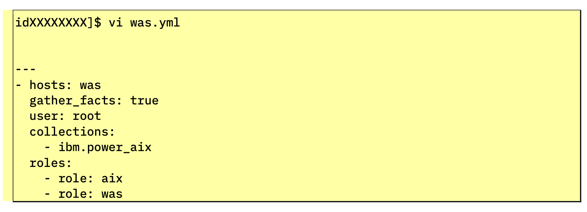

!!! tip "WAYS TO WATCH"
    In addition to the embedded video, IBMers and Business Partners can also <a href="https://ibm.seismic.com/Link/Content/DCGdHJ7DMdqHD8cV7Wp8f4Rg9Bgd" target="_blank">download the recording from Seismic</a>.

As with the **aix** Roles previously, you will need to craft a workflow of automation tasks that WebSphere Application Server (WAS) will require for a full deployment, covering a variety of tasks: uploading and decompressing the WAS binaries, preparing the Installation Manager, the generation of WAS binaries, the installation of WAS itself, the creation of a WAS profile, and starting up the WAS services. All of these tasks will be defined once, and made repeatable and fully automated for the future, using the was Role that you will now define.

The following Ansible Modules will be invoked as part of the sequence of jobs and tasks that the automation engine performs:

- **unarchive**: Uploads files (tar, zip, tgz, ...) and decompresses them on a target system.

- **shell**: Allows the execution of commands on a target system.

- **template**: Processed by the Jinja2 templating language and used for generating dynamic files.

- **copy**: Uploads files to a target system.

First, return to the *was.yml* Playbook that was defined earlier:
```
vi was.yml
```

Recall that Git-cloned template had a commented-out line towards the end of the YAML definition: this line **"- role: was"** will link the new was Role (which you will define momentarily) to the litany of operations that the Ansible Playbook will perform and interact with.

!!! note "IF WORKING FROM A CLONED GIT REPOSITORY"
    If you cloned the Git template previously, un-comment the line by deleting the # symbol. Otherwise, if you crafted the YAML file from scratch, add the instruction to the end of your Playbook.

The final version of the Playbook should mirror the following template:



```
---
- hosts: was
  gather_facts: true
  user: root
  collections:
    - ibm.power_aix
  roles:
    - role: aix
    - role: was

```

Press *ESC* and then *:x* and *Return* to save and exit the **was.yml** file.

!!! warning "ATTENTION"
    In the instructions to follow, you will be asked to gradually add more automation jobs to the **was** Roles that you just defined. You have two options for how to proceed here:

    1. Take advantage of the Git-cloned repository, which contains the fully-completed YAML definition, ready for immediate execution. This is the recommended path for those with **Seller** responsibilities.

    2. Go through and add the following jobs one at a time, in sequence, testing execution of the Playbook at each stage. This route will allow you to incrementally make changes to the Roles, test the results with the Playbook, and see for yourself the gradual progression of the installation and deployment of WebSphere Application Server. This is the recommended path for those with **Technical Seller** responsibilities.

Either path is appropriate, so tailor it to your needs or interests. Good luck!
