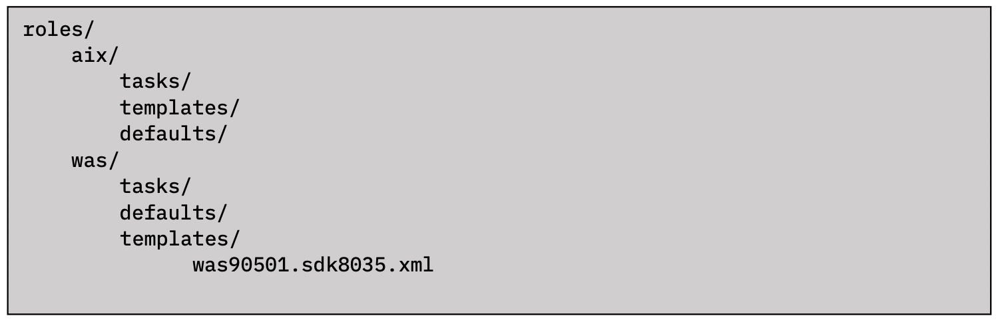
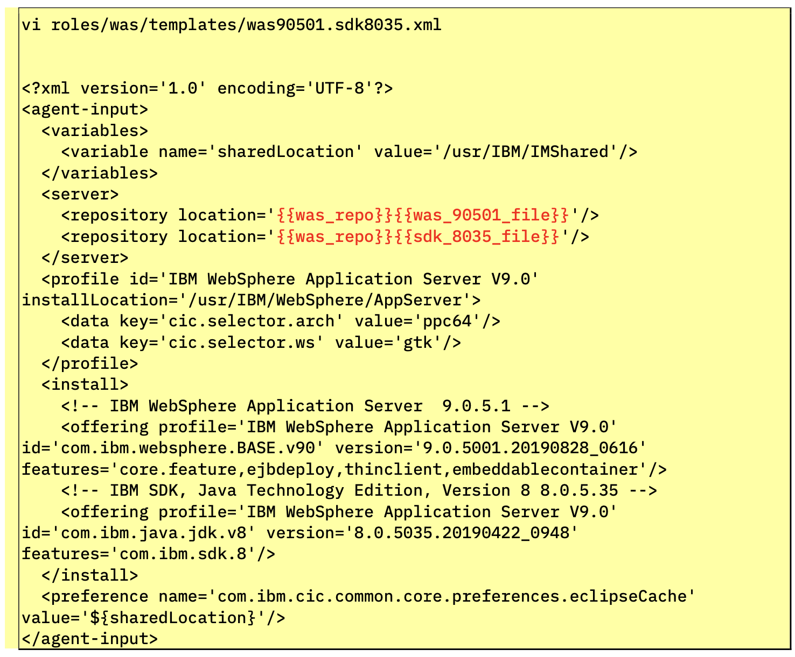

!!! tip "WAYS TO WATCH"
    In addition to the embedded video, IBMers and Business Partners can also <a href="https://ibm.seismic.com/Link/Content/DCGdHJ7DMdqHD8cV7Wp8f4Rg9Bgd" target="_blank">download the recording from Seismic</a>.

**WebSphere Installation Manager** requires an XML file (known as a **response file**) to detail where the installation should take place, the version of WAS to be installed, the versions of Java and other dependencies, and so on. The file must be located inside of the *roles/was/templates* directory and titled **was90501.sdk8035.xml** for the purposes of this lab.

The directory structure will look like the following:



AAP has a number of modules that can be used to modify existing files. These include **lineinfile** and **blockinfile**, among others. However, they are not always easy to use effectively and correctly. A much more powerful way to manage files is to template them. With this method, you can write a template configuration file that is automatically customized for the managed host when the file is deployed, using Ansible **variables** and **facts**. This can be easier to control and is less error-prone.

Ansible uses the **Jinja2** templating system for template files. Ansible also uses Jinja2 syntax to reference variables in Playbooks, and as such it will look structurally similar to what you have seen previously with YAML-based Playbooks. A Jinja2 template is composed of multiple elements: data, variables, and expressions. Those variables and expressions are replaced with their values when the Jinja2 template is rendered. You will see an example of this shortly after we execute the Playbook and compare how the variables defined within the XML file are changed.

Edit (or create) the XML response file by executing this command:

```
vi roles/was/templates/was90501.sdk8035.xml
```

The variables of note, specific to this environment, are highlighted in red text. You do not need to modify this template from how it is written — these variables are highlighted only to showcase what is different from the standard Installation Manager boilerplate. Your XML file must mirror the following template before continuing with the hands-on material.




```
<?xml version='1.0' encoding='UTF-8'?> <agent-input>
<variables>
<variable name='sharedLocation' value='/usr/IBM/IMShared'/>
  </variables>
  <server>
<repository location='{{was_repo}}{{was_90501_file}}'/>
<repository location='{{was_repo}}{{sdk_8035_file}}'/> </server>
<profile id='IBM WebSphere Application Server V9.0'
installLocation='/usr/IBM/WebSphere/AppServer'> <data key='cic.selector.arch' value='ppc64'/> <data key='cic.selector.ws' value='gtk'/>
  </profile>
  <install>
<!-- IBM WebSphere Application Server 9.0.5.1 -->
<offering profile='IBM WebSphere Application Server V9.0' id='com.ibm.websphere.BASE.v90' version='9.0.5001.20190828_0616' features='core.feature,ejbdeploy,thinclient,embeddablecontainer'/>
<!-- IBM SDK, Java Technology Edition, Version 8 8.0.5.35 -->
<offering profile='IBM WebSphere Application Server V9.0' id='com.ibm.java.jdk.v8' version='8.0.5035.20190422_0948' features='com.ibm.sdk.8'/>
</install>
<preference name='com.ibm.cic.common.core.preferences.eclipseCache' value='${sharedLocation}'/>
</agent-input>
```


When satisfied, press *ESC* followed by *:x* and *Return* to save and edit the file.

Now you must set default variables for the WAS Roles, which will be used later when generating the response file for the Installation Manager. Edit (or create) the following YMAL template file:
```
vi roles/was/defaults/main.yml
```

The YAML file definition should mirror the following:

```
was_repo: /tmp/wasrepo/
was_90501_file: was.repo.90501.base.zip
sdk_8035_file: sdk.repo.8035.java8.aix.zip
was_90501_source_dir: /files/aix/websphere/was/was9051/
sdk_8035_source_dir: /files/aix/websphere/sdk/sdk8035/
```


You are now ready to make additional modifications to the primary Playbook, instructing Ansible to generate and upload the template for WAS. Instruct the VI editor to open the Playbook with the same command used before:
```
vi roles/was/tasks/main.yml
```

!!! warning "main.yml"
    **Technical Sellers**: Extend the Playbook to resemble the following template.

    **Sellers**: Leave the completed Playbook unmodified.


```
---
- name: Creating staging directory
  file:
    path: /tmp/im
    state: directory

- name: copying IM source files
  unarchive:
    src: /files/aix/websphere/InstallationManager/1.8.9.4/aix.gtk.ppc_1.8.9004.20190423_2015.zip
    dest: /tmp/im
    creates: /tmp/im/userinstc.ini

- name: installing installation manager
  shell: /tmp/im/installc -log /tmp/im.lof -acceptLicense

- name: uploading was installation response file
  template:
    src: templates/was90501.sdk8035.xml
    dest: /tmp/was90501.sdk8035.xml

- name: Creating wasrepo directory
  file:
    path: "{{was_repo}}"
    state: directory

- name: copying binaries to wasrepo
  copy:
    src: "{{item}}"
    dest: "{{was_repo}}"
  loop:
    - "{{was_90501_source_dir}}{{was_90501_file}}"
    - "{{sdk_8035_source_dir}}{{sdk_8035_file}}"

```


The extensions to the Playbook will create a directory **was_repo: /tmp/wasrepo/** and then instruct Ansible to upload WAS binaries to the target system.

Press *ESC* and then *:x* and *Return* to save and exit the Playbook.

Using **loops** saves administrators from having to write multiple tasks (repetitively and redundantly) to make use of the same module(s). For example, instead of writing five tasks to ensure five users exist, you can write one task that iterates over a list of five users to ensure they all exist. Ansible supports iterating a task over a set of items using the loop keyword. You can configure loops to repeat a task using each item in a list, the contents of each of the files in a list, a generated sequence of numbers, or using more complicated structures.

!!! warning "TECHNICAL SELLERS"
    As before, you can execute the Playbook at this stage to carry out the new modifications that have been added since the last execution.
    ```
    ansible-playbook was.yml -v
    ```
