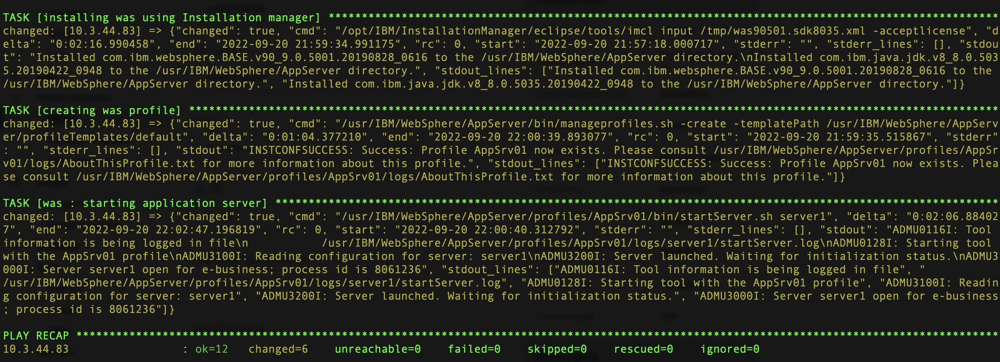
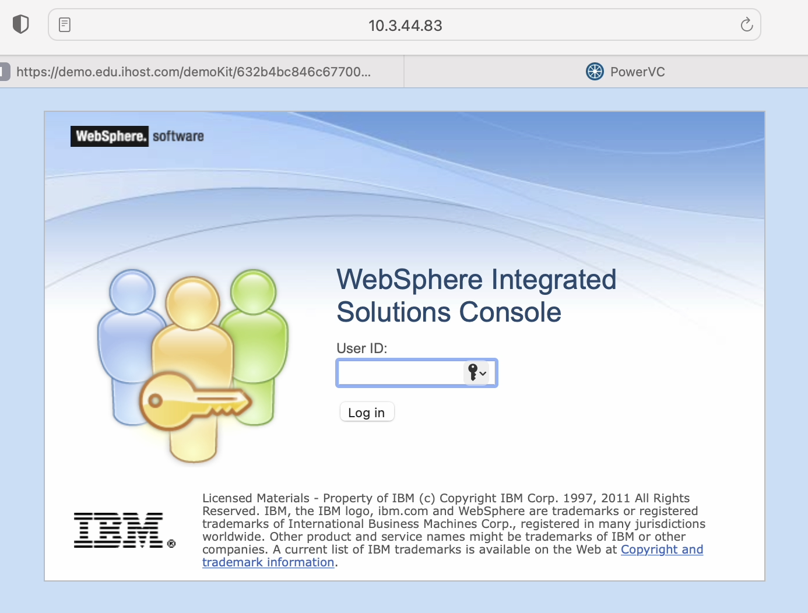

!!! tip "WAYS TO WATCH"
    In addition to the embedded video, IBMers and Business Partners can also <a href="https://ibm.seismic.com/Link/Content/DCdhQRCMq9R4fG4MRdCgqFmPDPWG" target="_blank">download the recording from Seismic</a>.

Further modifications to the primary Playbook are required to complete the installation of WAS, generate the necessary profiles, and fully launch the software.

Once again, edit the Playbook YAML manifest:

```
vi roles/was/defaults/main.yml
```

!!! tip "main.yml"
    **Technical Sellers**: Extend the YAML file as you have done previously so that the final version matches the template documented below.

    **Sellers**: As you are working from a completed YAML file that was cloned from the Git repository, you do not need to make any modifications to the file.

The finalized *main.yml* Playbook should exactly mirror the following template:


```
---
- name: Creating staging directory
  file:
    path: /tmp/im
    state: directory

- name: copying IM source files
  unarchive:
    src: /files/aix/websphere/InstallationManager/1.8.9.4/aix.gtk.ppc_1.8.9004.20190423_2015.zip
    dest: /tmp/im
    creates: /tmp/im/userinstc.ini

- name: installing installation manager
  shell: /tmp/im/installc -log /tmp/im.lof -acceptLicense

- name: uploading was installation response file
  template:
    src: templates/was90501.sdk8035.xml
    dest: /tmp/was90501.sdk8035.xml

- name: Creating wasrepo directory
  file:
    path: "{{was_repo}}"
    state: directory

- name: copying binaries to wasrepo
  copy:
    src: "{{item}}"
    dest: "{{was_repo}}"
  loop:
    - "{{was_90501_source_dir}}{{was_90501_file}}"
    - "{{sdk_8035_source_dir}}{{sdk_8035_file}}"

- name: installing was using Installation manager
  shell: /opt/IBM/InstallationManager/eclipse/tools/imcl input /tmp/was90501.sdk8035.xml -acceptlicense
  tags: template

- name: creating was profile
  shell: /usr/IBM/WebSphere/AppServer/bin/manageprofiles.sh -create -templatePath /usr/IBM/WebSphere/AppServer/profileTemplates/default
  tags: template

- name: starting application server
  shell: /usr/IBM/WebSphere/AppServer/profiles/AppSrv01/bin/startServer.sh server1
  tags: template
```


When satisfied, press ```ESC``` followed by ```:x``` and ```Return``` to save and exit the YAML file.

Finally, execute the following Playbook to kick off the end-to-end deployment of WebSphere Application Server:

```
ansible-playbook was.yml -v
```
!!! tip "SELLERS AND TECHNICAL SELLERS"
    This step must be performed by *both* **Sellers** and **Technical Sellers**.

Wait until the Playbook has finished executing and the "*PLAY RECAP*" has been printed to screen within the Terminal console. Successful execution of the full Playbook may take several minutes to complete. If all jobs have successfully been executed (with status as "*OK*"), then WebSphere Application Server should now be successfully installed on the AIX LPAR and the services now live for you to interact with!



Test that WebSphere Application Server is now online by visiting the following address with your Web browser:


```
http://10.3.XX.XX:9060/ibm/console
```


!!! tip "HOST ADDRESS"
    Substitute the missing variables with the IP address of your AIX LPAR (this is the address summarized just below the PLAY RECAP in the screenshot above) — remember to use the address unique to *your* environment. Ensure that you are still connected to the OpenVPN tunnel before attempting to access the WAS service.



You may input any *userID* that you wish (remember that we disabled authentication in an earlier step) and then click *Log In* to access the WAS dashboard.

#
# **Congratulations** — you have successfully installed and deployed a WebSphere Application Server environment on PowerVC entirely using Red Hat Ansible Automation Platform!

!!! note "BUSINESS PARTNERS"
    Keep your browser window open to the WAS dashboard. The series of questions in <a href="https://ibm.github.io/Ansible-Automation-Platform-L3/Part%204/01%20Business%20Partner%20Accreditation/" target="_blank">Part 4</a> will be repeated on your **L3 accreditation quiz**. Use this time to investigate the various areas of the WAS dashboard so that you can prepare for the quiz and quickly certify your completion of this hands-on material.

!!! warning "IBM SELLERS AND TECHNICAL SELLERS"
    Begin planning how you wish to present and record your **Stand & Deliver**. Replicate the steps and lessons learned throughout this hands-on material and ensure that your recording meets all of the evaluation criteria outlined in the <a href="https://ibm.github.io/Ansible-Automation-Platform-L3/Part%204/02%20IBMer%20Accreditation/" target="_blank">Stand & Deliver requirements</a>.
