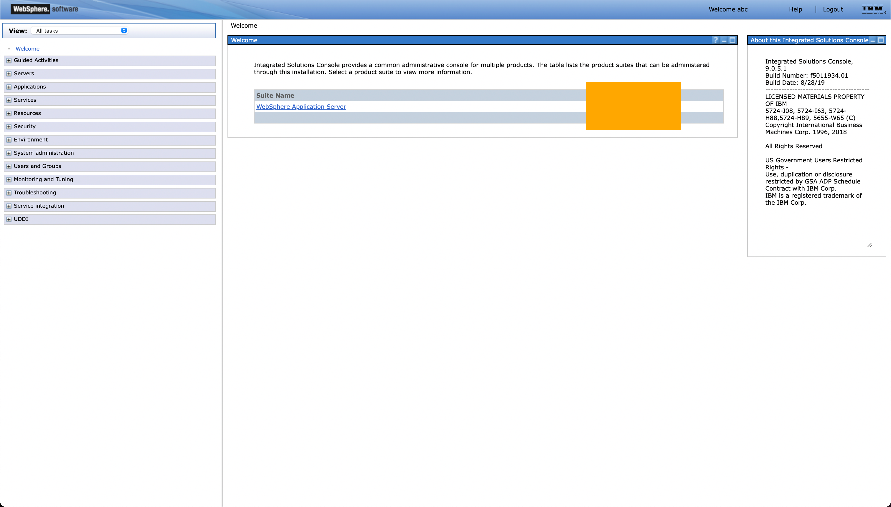
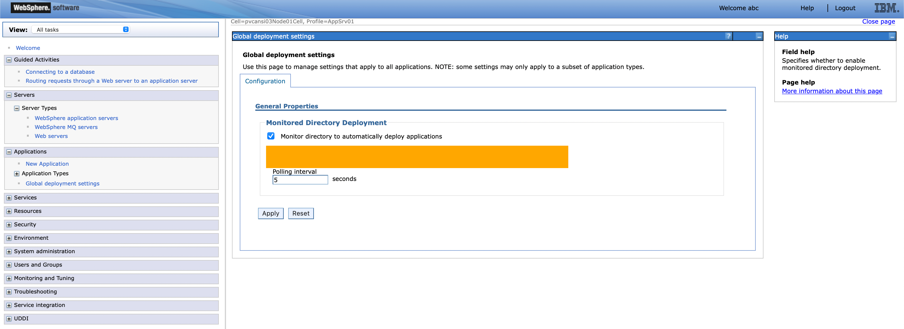
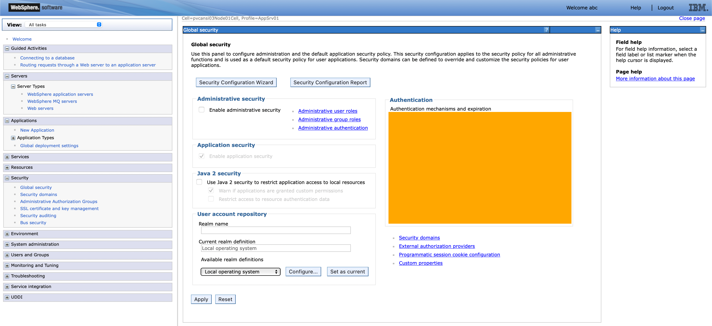
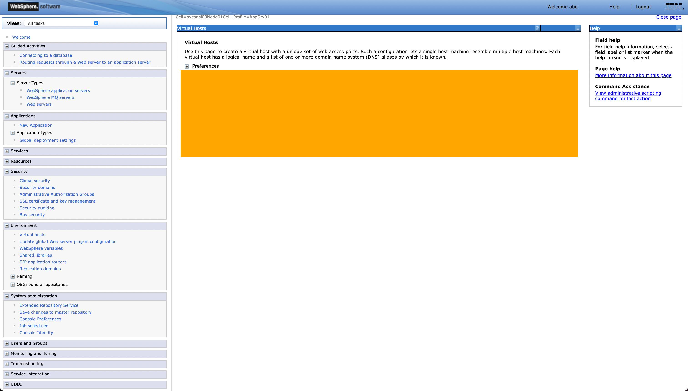
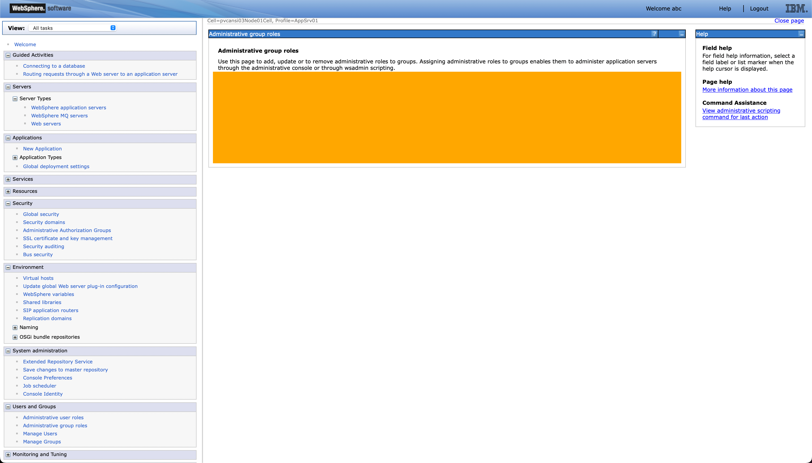
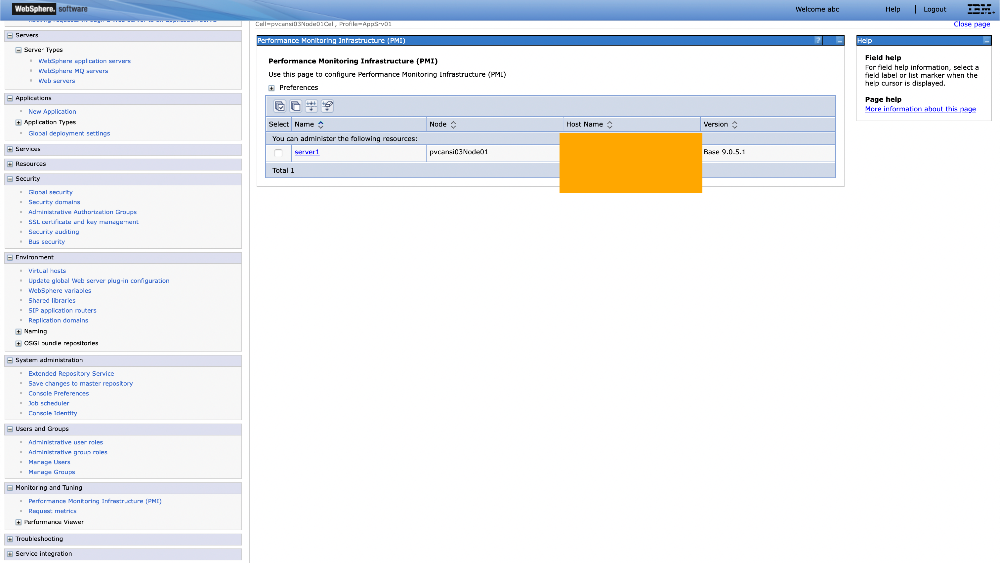

!!! tip "WAYS TO WATCH"
    In addition to the embedded video, IBMers and Business Partners can also <a href="https://ibm.seismic.com/Link/Content/DCd37M4RVM3HhGWRBbWDjHpqD4M3" target="_blank">download the recording from Seismic</a>.

#
# Business Partners must pass an **accreditation quiz** after completing the hands-on work.
The quiz consists of multiple choice questions, with four possible responses (and only one correct answer) for each question. The quiz questions are based on elements of the WebSphere Application Server (WAS) web dashboard, which you will be asked to investigate and record specific details about.

The WAS environment and dashboard will be available to you after you have successfully concluded the lab work — remaining online until your ITZ reservation has expired.

!!! note "EXPIRING ENVIRONMENTS"
    Note that the ITZ environment can only be reserved for 4 hours at a time. After this period, the instance will automatically be retired and decommissioned. It is strongly recommended that you complete your investigations for the quiz questions (below) _before_ that time has expired. If not, you will need to run through the lab work another time to bring the WAS environment back online.

    Record your answers *now* so that you can quickly answer the accreditation quiz questions *later*.

!!! tip "HINT!"
    The screenshots below have been modified to obscure the relevant fields, but the orange boxes give you a good idea for where to find the answers on the WAS dashboard.

#
#
#

1. On the **Welcome** screen presented after logging into the WebSphere Application Server dashboard, a *Suite Name* and *Version* of the environment are presented center-screen. What is the *Version* number of the environment that Ansible has deployed?

2. Drilling down into the **Applications** tab on the left of the WebSphere Application Server dashboard, click the **Global Deployment Settings** page. This page configures and monitors directories to automatically deploy applications. What is the address of the default "*Monitored Directory*"?

3. Drilling down into the **Security** tab on the left of the WebSphere Application Server dashboard, click the **Global Security** page. Under the *Authentication* field, there are a variety of options available to choose from. Which of the "*Authentication mechanisms and expiration*" is enabled by default?

4. Drilling down into the **Environment** tab on the left of the WebSphere Application Server dashboard, click the **Virtual Hosts** page. Here you can create a virtual host with a unique set of web access ports. What is the name of a *Virtual Host* that is available by default with your WebSphere Application Server deployment?

5. Drilling down into the **Security** tab on the left of the WebSphere Application Server dashboard, click the **Administrative Group Roles** page. Here you can manage the administrative permissions assigned to groups. What is the name of a *Group* that is available by default with your WebSphere Application Server deployment?

6. Drilling down into the **Monitoring and Tuning** tab on the left of the WebSphere Application Server dashboard, click the **Performance Monitoring Infrastructure (PMI)** page. Of the resources being monitored, there is one ('*server1*') available by default. What is the *Host Name* of that server?

