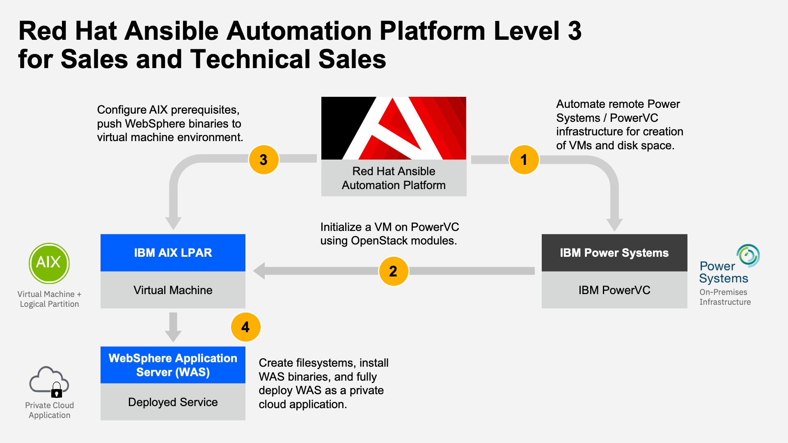

!!! tip "ACKNOWLEDGEMENTS"
    Special thanks to **Stephan Navarro** for authoring the original version of this hands-on lab, "Deploying WebSphere Application Server on AIX using Ansible Automation" for IBM Client Engineering for Systems (Montpellier). In addition to the embedded video, IBMers and Business Partners can also <a href="https://ibm.seismic.com/Link/Content/DCpVPHMDTfqdQ82MT689Dp23RFcV" target="_blank">download the recording from Seismic</a>.

Automation of nearly any infrastructure endpoint with minimal amounts of code has immense practical value to a world increasingly dependent on clouds operated by different vendors, in varying countries, across multiple premises. Implementation of modern automation solutions can likewise translate to a number of benefits for businesses of every size: reduced storage and resource burden placed on the machines to be automated; a much smaller footprint on these endpoints that could be hacked or exploited by malicious users; and most importantly, a greatly simplified approach to automation in general.

As environments change and operating systems advance over time, the automation jobs underway and supported by these technologies can be easily modified in lockstep as well. Adaptability and extensibility are key ingredients in the longevity of any technology — and fortunately, the automation tooling for the hybrid multicloud era has those in abundance.

#
#**Red Hat Ansible Automation Platform (AAP)** commodifies the automation of everything else that applications, services, and containers need to run upon.

That may include infrastructure provisioning, server deployments, IoT edge devices, script execution, and lots of other things that operations teams spend their time doing to “keep the lights on.” AAP makes automation available to everyone with the lightest touch of human-readable snippets of code.

!!! note "TERMINOLOGY"
    Ansible and AAP may be used interchangeably — and will be throughout the course of this lab work.

Who uses AAP today? Many different and potentially siloed personas:

1. **IT Operators**: These include automation administrators responsible for ensuring that the automation platform is available to developers and implementors upstream within the organization. These individuals are generally concerned with the uptime of the automation platform, as any interruptions to service availability can directly impact upstream users.

2. **Platform Developers**: These individuals are the automation "plumbers" who ensure that endpoints are viable for automation. Tasks and responsibilities include maintaining the AAP modules, plugins, and the Roles (content) to be used by platform users. They are the domain experts that are coding up collections which can later be extended or consumed by the end-users of the automation jobs.

3. **Platform Users**: These are the automation "writers," stitching together each automation task— play by play, task by task —using content generated by the Platform Developers within their Playbooks.

Essentially, this is configuration management applied to the operations of IT estates. Instead of having a hardcoded script that instructs exactly how to move from task A to task B, you are creating a Playbook that lays out the expected end state and asks AAP to figure out the delta between the current and end state. But critically, AAP will not move on to task B until all of the conditions required by task A have been satisfied. This is not only invaluable for debugging purposes; it also guarantees a consistency and predictability to how AAP's automation tasks will be performed — something that you will come to keenly appreciate throughout this hands-on material, as we incrementally add more tasks and automation jobs to Playbooks for execution.

Together, these qualities have two profound implications for AAP clients. First, it removes any ambiguity from the automation process: AAP will execute your instructions in exactly the order you’ve assigned. Second, it places the burden of deciding how to achieve the end states of tasks A and B on the automation engine itself, rather than requiring the user to explicitly define all the gory details themselves.

#
# When automation is made available to everyone, it becomes possible to automate everything.

The series of hands-on tutorials and learning modules embedded in this Level 3 course are designed to provide IBM Sellers, IBM Technical Sellers, and Business Partners with the fluency to gain trusted advisor status with clients and the expertise to tailor live technological demonstrations for customers.

Throughout **Red Hat Ansible Automation Platform Level 3 for Sales and Technical Sales**, you will utilize AAP in conjunction with IBM Power Systems infrastructure (PowerVC) to generate an IBM AIX-based virtual machine; subsequently, Ansible automation will be used to install and deploy a live WebSphere Application Server instance inside of the virtual machine. The various ways in which AAP's automation can also be applied to operational and administrative tasks— such as modifying root user characteristics, setting filesystem sizes, installing pre-requisites drivers and libraries, as well as software deployments —will also be explored.

All modules are accompanied by recordings and narrated instructions, delivered by your team of authors. It is strongly recommended that IBM Sellers and Technical Sellers watch these recordings, as they will be useful for you as you go about creating and recording your own Stand & Deliver presentations for Level 3 accreditation.

!!! note "LEVEL 3 ACCREDITATION"
    To receive Level 3 accreditation, IBMers and Business Partners must demonstrate mastery of the skills learned throughout the various modules of these hands-on labs and coursework. Level 3 accreditation requirements— and the way in which participants will be evaluated before receiving accreditation —differs depending on job role.

**Business Partners** must pass an accreditation quiz after completing the hands-on portion of the course. The quiz consists of multiple choice questions, with four possible responses (and only one correct answer) for each question.

**IBM Sales and Technical Sales** must develop and record a Stand & Deliver presentation. This video is intended to simulate your delivery of a “live” demo in front of a client — on camera. IBMers will have flexibility in defining a hypothetical client, the pain points that customer has, and the goals they aspire to achieve. The recording must cover the seller’s hands-on demonstration and pitch to the client of the value of the IBM solution using the environments and techniques covered in this lab.

Specific criteria that must be demonstrated as part of the Stand & Deliver recordings is <a href="https://ibm.github.io/Ansible-Automation-Platform-L3/Part%204/01%20Business%20Partner%20Accreditation/" target="_blank">provided within the documentation that accompanies the Level 3 course</a>.

!!! tip "LOOKING FOR COURSEWORK?"
    The material covered in this hands-on lab is part of accredited learning and badging for IBMers and business partners. Shortcuts to the respective learning plans are available below:

    *IBM* | <a href="https://yourlearning.ibm.com/activity/PLAN-4F862361240F" target="_blank">Sellers</a> | <a href="https://yourlearning.ibm.com/activity/PLAN-670B279B8786" target="_blank">Technical Sellers</a>

    *Business Partners* | Sellers | Technical Sellers
